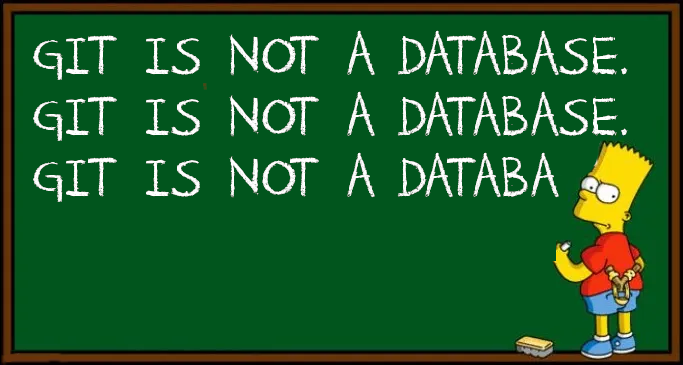

 
**"Git is not a database."—but what if it was?** With YAML datastore, you can make your data Git-friendly. 

YAML Datastore is a lightweight library that stores and manages data with structured plaintext files and YAML syntax, designed for use with version control systems. This enables you to gain the advantages of Git for your data—track changes at the feature level, store data across multiple systems, and merge data seamlessly. 

**Getting Started**

* New to YAML Data Store? Get [introduced](#introduction)
* Ready to install? Follow the [installation steps](#installation)
* Want to learn how YAML Datastore works? Read [our user guide](#yaml-datastore-user-guide)
* Want to use the API? See [the API documentation](#api-docs)

# Introduction
Contents
!toc (numbered)

## What is YAML Datastore?
YAML Datastore is a lightweight Typescript library designed for observable, human-readable data storage and retrieval using YAML files. It serves as an alternative to traditional databases that do not store data in a version control-friendly way.

## Purpose of YAML Datastore
YAML Datastore exists because we rather than try to add Git-like features to how we store and manage data, we want to do data management in a way that fits in Git. We found that existing systems attempting to use Git as a backend didn't account properly for structure. YAML Datastore automatically manages this structure with easy to understand rules that we explain in the User Guide. 

# Installation
1. Installation Steps

# YAML Datastore User Guide

This User Guide provides comprehensive details about how YAML Datastore manages data. Learn how the YAML Datastore library organizes and stores data on disk, about the algorithm used to transform in-memory objects and lists into a collection of YAML files, the data types supported, and the conventions followed for file layout.

### How it works
YAML datastore uses a set of straightforward rules to map the data into YAML files and directories. This approach ensures that data is always human-readable, modular, and easy to reconstruct.

YAML Datastore implements the standard CRUD operations for file-based data:
- The `store` and `load` operations transform in-memory objects and lists into structured YAML files and back.
- Helper Classes - The results class captures operation outcomes, including status and content.

YAML Datastore includes Command Line tools:
- `yds-store`: Command-line interface for storing data.
- `yds-load`: Command-line interface for loading data.
- `yds-ids`: Command-line interface for generating ids

### Supported Data Types
You can store:
- **Objects**: Any object with key-value pairs, including nested objects.
- **Lists (Arrays)**: Arrays of values, objects, or other lists.
- **Nested Structures**: Both objects and lists can be nested to any depth, allowing you to represent complex models.

The algorithm supports **simple** and **complex** data types:
- **Simple Types**: Strings, numbers, booleans, nulls. These are stored directly in the YAML file.
- **Complex Types**: Multi-line strings, large objects/lists, and references. 
  - Multi-line strings are stored in separate files, referenced from their parent object.
  - Nested objects and lists can be split into their own files for modularity and clarity.

## Data Types and their On Disk Representations

This section provides an explanation for each supported datatype with a typedoc generated example.

!include(test/spec/1.1_object_with_simple_data_types/README.md)

!include(test/spec/1.2.1_object_with_complex_string/README.md)

!include(test/spec/1.2.2_object_with_object_of_simple_data_types/README.md)

!include(test/spec/1.2.3_object_with_object_of_complex_data_types/README.md)

!include(test/spec/1.2.4_object_with_list_of_simple_data_type/README.md)

!include(test/spec/1.2.5_object_with_list_of_simple_data_types/README.md)

!include(test/spec/1.2.6_object_with_list_of_complex_strings/README.md)

!include(test/spec/1.2.7.1_object_with_list_of_objects_of_simple_data_types/README.md)

!include(test/spec/1.2.7.2_object_with_list_of_list_of_simple_data_type/README.md)

## API Docs
!include(docs/README.md)

# License
Mach30/yaml-datastore is licensed under the [Apache 2.0 License](https://github.com/Mach30/yaml-datastore/blob/main/LICENSE).

# Contributions
Include information about developer documentation, contribution policy and community chat boards
